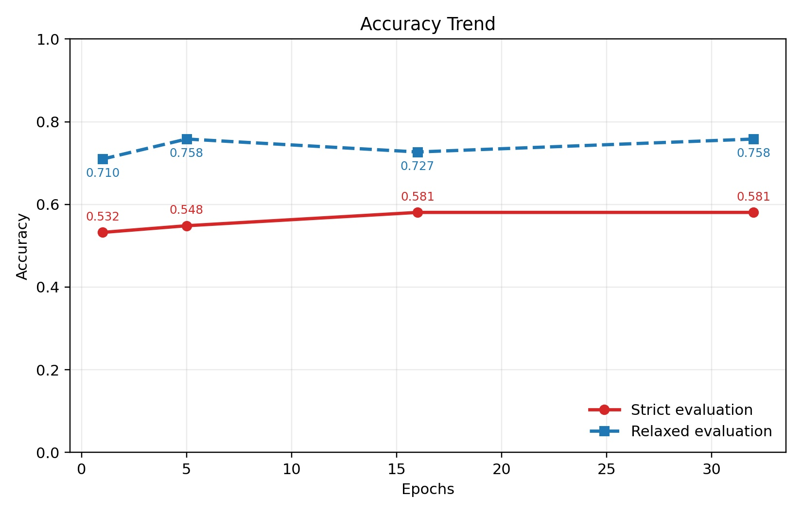

This is the capstone project for Johns Hopkins University’s GPU Programming course series on Coursera.

LeNet-5 is one of the earliest and most influential convolutional neural networks (CNNs). It was developed in 1998 by Yann LeCun and colleagues at Bell Labs.

In this project, I trained a LeNet-5–like model to recognize images of 0–9, A–Z, and a–z. The model was trained using PyTorch, and inference was implemented using several Nvidia CUDA libraries (e.g., NPP, cuDNN, and cuBLAS), as well as custom CUDA kernels.

# Model Architecture
This is a modernized LeNet-5 architecture adapted for 62-class classification (digits + uppercase + lowercase letters).

## Architecture Overview
Input (28×28×1) → Conv1 → ReLU → Pool1 → Conv2 → ReLU → Pool2 → FC1 → ReLU → FC2 → ReLU → FC3 → Output (62 classes)

## Layer-by-Layer Breakdown
### Input:
* 28×28 grayscale image (1 channel)

### Conv1 Block:
* Conv2d(1, 6, kernel_size=5, stride=1, padding=2) → 28×28×6
* ReLU() activation
* MaxPool2d(2, 2) → 14×14×6
* Padding=2 preserves spatial dimensions  

### Conv2 Block:  Conv 5x5, 6 input, 16 output
* Conv2d(6, 16, kernel_size=5) →  
* ReLU() activation
* MaxPool2d(2, 2) → 5×5×16

### Fully Connected Layers:
* FC1: Linear(400, 120) → 120 units
* ReLU() activation
* FC2: Linear(120, 84) → 84 units
* ReLU() activation
* FC3: Linear(84, 62) → 62 output classes (logits)

# Directory Structure
## data
Used EMNIST dataset(torchvision.datasets.EMNIST) to train. PyTorch downloads the dataset to this directory if the data has not been downloaded yet.

## inputs
Used Microsoft copilot to help generate the .jpeg files to test the model inferencing.
* test1: Copilot generated 62 .jpeg files that looks like hand written.
* test2: Copilot generated 62 .jpeg files with images inspired by Font named Patrick Hand. 

## model
The model weights and the standard output from model training are stored in the following subdirectories.

* model1: trained for 1 epoch. For example, conv1_w.bin contains the weights for the first convolution layer, and conv1_b.bin contains the bias values. training1.txt is the standard output generated when the model was trained.
* model5: trained with 5 epochs
* model16: traind with 16 epochs
* model32: trained with 32 epoches

## src
* Training: the python code to train the model. 
* Inference: the C++ code to run inferencing on the model.

# Model Evaluation
All models were evaluated on two datasets (test1 and test2). A more comprehensive evaluation would require a much larger test dataset. However, due to time constraints, this was not conducted. For a given model, the results were similar on test1 and test2.

With only a single character and without any additional context, it is difficult to distinguish among O, o, and 0. Therefore, the evaluation includes two modes: strict and relaxed. In relaxed mode, a prediction is considered correct if it predicts O while the label is o. Under inputs/test1, you can find the evaluation outputs for each model and each mode. For example, results1.txt is the evaluation of model1 in strict mode, and results1-relaxed.txt is the evaluation of model1 in relaxed mode.

Below is the accuracy trend with respect to model training epochs. You can see that the model performance saturates at around 16 epochs. There is little difference among 5 epochs, 16 epochs, and 32 epochs.

